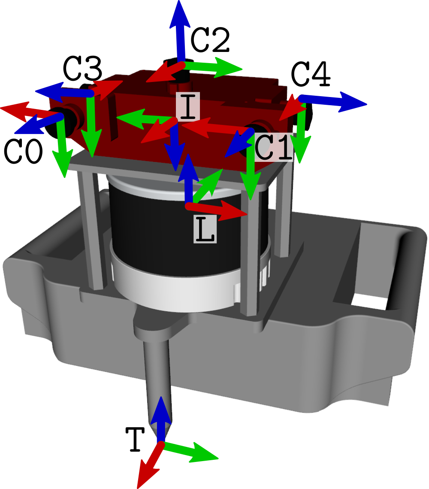

# Hilti-SLAM-Challenge-2022


Visit the Hilti SLAM Challenge [homepage](https://hilti-challenge.com/) for more information.

# FAQ

## Which datasets should be submitted for the challenge?
The more datasets you submit the more points you can get. The datasets where we provide the groundtruth are not considered in the final score.

## If we submit the result, are you going to disclose the name of all the participants?
We disclose the names only after prior approval. Before making the leaderboard public I will send out an email to all participants with their respective rank and the option to withdraw.

## How are the results scored?
The submission will be ranked based on the completeness of the trajectory as well as on the position accuracy (ATE). The score is based on the ATE of individual points on the trajectory. Depending on the error between 10 and 0 points are added to your final score. This way also incomplete trajectories can be included in the evaluation. You always can submit your current results and receive an accuracy report using our [submission system](https://submit.hilti-challenge.com/). 

## Is the ground truth available?

We provide ground truth for selected datasets. Please you our [submission system](https://submit.hilti-challenge.com/) to test your algorithm. We will also provide high-accuracy laserscans for selected datasets after the challenge.

## We noticed that the timestamp for every point in a lidar point cloud scan is equal. Is it possible to correct this issue?
The Hesai ros driver stores the timestamp in this [struct](https://github.com/HesaiTechnology/HesaiLidar_General_ROS/blob/master/src/HesaiLidar_General_SDK/src/PandarGeneralRaw/include/pandarGeneral/point_types.h). What happens is the `sensor_msgs/PointCloud2` Message has a "data" member in byte and it stores the `PointXYZIT` defined time, xyz, etc. The "field" member describes what type of info is in "data". In a programme, one would convert the `PointCloud2` msg into `PointXYZIT` msg to access all the element pandar records. 

## How are the frames defined on the sensor setup?
Below is a schematic of the reference frames (red = x, green = y, blue = z):

The frames are:
- `C0` to `C4` are the camera frames of the alphasense.
- `I` is the IMU frame as installed on the alphasense. Note that this is also the same frame the ground truth is defined in.
- `T` is the tip frame. A calibration between IMU and tip is provided.

## Is there a URDF model of the sensor setup?
Yes, now there is! You can clone and compile the following ROS packages:
- [`phasma_description`](https://github.com/Hilti-Research/phasma_description.git): this is the main URDF model of the sensor setup.
- [`hesai_description`](https://github.com/Hilti-Research/hesai_description): this is the URDF model of the HESAI. It's a dependency of `phasma_description`.
- [`alphasense_description`](https://github.com/Hilti-Research/alphasense_description): this is the URDF of the Alphasense. It's a dependency of `phasma_description`.

To have them in you system you can just clone and compile them in your catkin workspace, for example:
```
cd ~/catkin_ws/src/
git clone https://github.com/Hilti-Research/phasma_description.git
git clone https://github.com/Hilti-Research/hesai_description.git
git clone https://github.com/Hilti-Research/alphasense_description.git
cd ..
catkin build phasma_description
```

